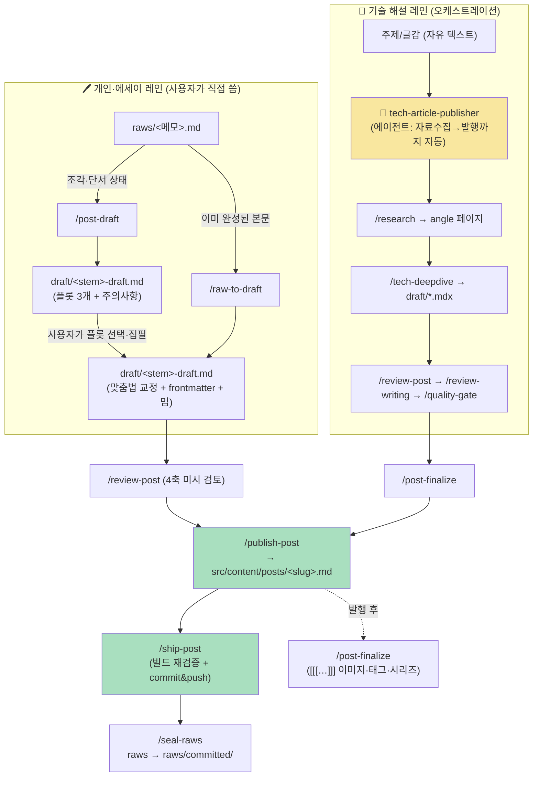

# 빵관 토니 — 글쓰기 블로그

> "Serious Work, Joyful Wit" — Astro 기반 개인 글쓰기 블로그. GitHub Pages 배포.
> 설계 언어는 [`design-concept/DESIGN_CONCEPT.md`](design-concept/DESIGN_CONCEPT.md)(v0.2), 개발 가이드는 [`CLAUDE.md`](CLAUDE.md).

```bash
bun install && bun dev      # 개발 서버
bun run build               # dist/ 정적 빌드 (검증은 build + preview로)
```

---

# 워크플로우 지도

이 저장소의 글쓰기는 **스킬(skill)** 과 **서브에이전트(agent)** 로 자동화돼 있다.
아래 지도는 **어떤 입력물**에 **어떤 트리거**를 발동하면 **어떤 산출물**이 나오는지를 정리한 것이다.

트리거는 두 가지 형태다.
- **`/skill-name`** 또는 자연어("이 글 형식화해줘") → 해당 스킬 실행
- **오케스트레이터 에이전트** → 여러 스킬을 순서대로 자동 실행

## 두 개의 집필 레인

글은 성격에 따라 두 갈래로 흐른다. 둘 다 종착지는 `src/content/posts/` 발행 + 레포 push.



- **개인 레인**: 사용자가 `raws/` 에 쓴 글 → 형식화/검토 → 발행 → 배포. 가볍고 사람 개입 중심.
- **기술 레인**: 주제 한 줄만 주면 `tech-article-publisher` 에이전트가 자료수집부터 push까지 자동으로 끝낸다.
- **대담 레인**: `raws/`를 거치지 않고 `/init-post --talk`로 `src/content/posts/`에 바로 MDX를 만든다. 자세한 표는 아래 7번.

---

## 입력물 → 트리거 → 산출물

### 1. 초안 만들기 (raws/ → draft/)

| 입력물 | 트리거 | 산출물 |
|---|---|---|
| `raws/<메모>.md` — **아이디어 조각·단서** | `/post-draft` | `draft/<stem>-draft.md` — 서로 다른 **플롯 3개 + 토픽 주의사항** (본문은 이후 사용자가 집필) |
| `raws/<원고>.md` — **이미 완성된 본문** | `/raw-to-draft` | `draft/<stem>-draft.md` — **맞춤법 표면 교정 + Astro frontmatter(draft:true) + `<<meme:>>` 밈 삽입**. 내용·구조·문체 불변 |
| `<slug> <category>` (raws 없이 바로) | `/init-post` | `src/content/posts/<slug>.md` — frontmatter만 갖춘 **빈 스켈레톤** (draft:true) |

### 2. 기술 글 집필 (자료 기반 심층 해설)

| 입력물 | 트리거 | 산출물 |
|---|---|---|
| 주제/글감 (자유 텍스트) | `/research` | `~/blog-research/wiki/angles/…` — 웹 신뢰 소스 5+ 수집·정리한 **angle 페이지** (별도 리서치 레포에 push) |
| angle 페이지 또는 `raws/` 글감 | `/tech-deepdive` | `draft/*.mdx` — 외부검토(codex·agy) 거친 **심층 기술 해설 초안**. React 시뮬·구조 이미지는 명세로 위탁 |

### 3. 검토·품질 게이트 (draft 대상)

| 입력물 | 트리거 | 산출물 |
|---|---|---|
| `draft/*.md(x)` | `/review-post` | **4축 미시 검토**(맞춤법/개연성/테크니컬 라이팅/몰입도) — 지적 목록 + (승인 시)교정 반영 |
| `draft/*.mdx` | `/review-writing` | **거시 글쓰기 게이트**(설득력/논리/구조[PREP·3WR·4MAT]/문체 일치) — PASS/FAIL, 통과까지 보완 반복 |
| `draft/*.mdx` | `/quality-gate` | **기술 품질 게이트**(깊이/완전성/다관점/정확성) — PASS/FAIL, 통과까지 보완 반복(최대 3회) |

### 4. 이미지·시뮬 삽입 (마커 → 실제 산출물)

본문에 남긴 **마커별로 담당 스킬이 다르다** (정규식이 서로 안 겹쳐 한 문서에 공존 가능):

| 마커 (입력) | 트리거 | 산출물 |
|---|---|---|
| `<<meme: 힌트>>` | `/meme-inserter` | 실제 인터넷 밈·움짤 검색·삽입 → `public/images/<slug>/memes/<n>.<ext>` |
| ` ```figure``` ` (JSON 명세) | `/make-image` | 비교표·단계도·포인트 카드 등 **구조형 정보 PNG** (HTML+CSS→Playwright 캡처) |
| `[[[ 은유·개념 단서 ]]]` | `/post-finalize` | OpenAI 이미지로 그린 **개념·은유 일러스트** webp |
| `(( 도메인 모델 설계도 ))` | `/mdx-concept-diagram` | **React 개념도** 컴포넌트 |
| 시뮬 명세(산문/JSON) | `/react-sim` | 조작 가능한 **인터랙티브 React 시뮬레이션** `.tsx` (MDX에 import + `<Name client:visible />`) |

### 5. 발행 마무리 (draft → 사이트 → 배포)

| 입력물 | 트리거 | 산출물 |
|---|---|---|
| 발행 대상 포스트 (`[[[…]]]`·`series` 포함 가능) | `/post-finalize` | `[[[…]]]`→일러스트, 본문 기반 **tags 추출**, 잔존 **시리즈 링크 섹션 제거**(네비는 `PostNav`·`SeriesEpisodes` 자동 렌더) |
| `draft/<…>-draft.md` | `/publish-post` | `src/content/posts/<slug>.md` — Astro frontmatter 채우고 **draft:false 발행, 원본 draft 삭제** |
| `src/content/posts/*.mdx` | `/ship-post` | `bun run build` 재검증(링크·이미지·스키마) 후 발행물 경로만 **commit & push** |
| 처리 끝난 `raws/*.md` | `/seal-raws` | 원본을 `raws/committed/` 로 **봉인**(발행과 분리된 정리 단계) |

### 6. 글 지도 데이터 (연관 글 · /graph)

| 입력물 | 트리거 | 산출물 |
|---|---|---|
| `src/content/posts/` | `bun run graph:refresh` (**main 워크트리 전용**) | `graphify-out/graph.json` — LLM 기반 지식 그래프 (커밋) + `graphify-out/cache/semantic/` — 증분 추출 상태 (커밋) |
| `graphify-out/graph.json` | 같은 스크립트가 `bun scripts/build-graph-data.ts` 호출 | `src/data/graph.json` — 빌드가 소비하는 **증류 그래프** (커밋) |
| `src/data/graph.json` | `astro build` | 각 글의 **연관 글 섹션** + `/graph` **글 지도 탐색기** (LLM·키 불필요) |

> **CI 계약**: `astro build` 는 절대 graphify를 실행하지 않고 커밋된 `src/data/graph.json` 만 읽는다. 파일이 없어도 빌드는 통과(frontmatter 기반 연관도로 degrade).
>
> **실행 시점**: 발행(`ship-post`)은 그래프를 건드리지 않는다. main 머지 후 main 워크트리에서 `bun run graph:refresh` 를 한 번 돌린다 — 병렬 워크트리가 각자 갱신하면 1MB JSON 이 충돌하고 어차피 형제 편 머지 즉시 stale 이 되기 때문이다. 스크립트가 브랜치·워크트리를 가드한다.
>
> **`graphify-out/cache/semantic/` 은 절대 gitignore 하지 마라.** 증분 추출의 상태가 그것뿐이라, 없으면 매 갱신이 전량 재추출(24편 기준 1.26M in / 280k out / 40~60분)로 되돌아간다. 자세한 근거는 `CLAUDE.md` 의 Graph data 절과 `scripts/seed-graph-cache.py` 헤더.

### 7. 폭신 대담 에피소드 (인터뷰 시리즈)

빵토 교수님과의 인터뷰 시리즈는 위 두 레인과 시작점부터 다르다. `raws/`를 거치지 않고 `/init-post --talk`로 `src/content/posts/`에 바로 MDX 스켈레톤을 만들며, frontmatter의 `template: talk`가 전용 레이아웃(`TalkLayout.astro`)을 켠다.

| 입력물 | 트리거 | 산출물 |
|---|---|---|
| `<slug> <category> [title] --talk` (또는 "대담"/"인터뷰 에피소드"/"빵토 교수님" 언급) | `/init-post --talk` | `src/content/posts/<slug>.mdx` — `template: talk` 프론트매터 + `<QA>`/`<PullQuote>`(이미 import된 상태) 빈 스켈레톤(draft:true), `series`/`order`는 같은 `series`의 최대 order+1로 자동 계산 |
| 스켈레톤의 `<QA n q>` 블록 | (사용자가 직접 집필) | 인터뷰어 질문 + 빵토 교수님 답변으로 채운 본문 — 컴포넌트는 이미 import돼 있으니 내용만 채우면 됨 |
| 채운 본문 (`src/content/posts/<slug>.mdx`) | `/review-post` (선택) | 4축 미시 검토 — `.mdx`도 `.md`와 동일하게 지원 |
| 채운 본문 | `/post-finalize` | 태그 추출, `series` 링크 섹션 삽입(`[[[…]]]` 있으면 이미지 치환도) — `.mdx` 경로 명시 지원 |
| 완성된 파일 | (수동) `draft: true` → `false` | 발행 상태 전환. **주의**: `/publish-post`는 `draft/` 폴더 초안을 `src/content/posts/`로 옮기는 스킬이라 이미 정식 경로에 있는 대담 파일에는 대상이 아니다 — 잘못 호출해도 대상 파일을 찾지 못해 안전하게 실패한다 |
| 발행 상태 파일 | `/ship-post` | 빌드 재검증 + commit & push |

예시: `/init-post talk-ep2 research --talk` (또는 자연어로 "빵토 교수님 대담 2화 만들어줘").

레이아웃·컴포넌트·설정 자산: `TalkLayout.astro`, `src/components/talk/QA.astro`·`PullQuote.astro`, `src/lib/talk.ts`(화자·배너 설정), 템플릿 자산 `src/templates/talk-episode.mdx`. 자세한 설정은 [`CLAUDE.md`](./CLAUDE.md)의 폭신 대담 절 참고.

---

## 오케스트레이터 에이전트

단일 스킬이 아니라 **여러 스킬을 순서대로 묶어** 돌리는 에이전트:

| 에이전트 | 하는 일 |
|---|---|
| **tech-article-publisher** | "기술 글 써줘" 한 마디로 **자료수집→발행→push** 전 과정 실행:<br/>`research` → `tech-deepdive` → `review-post` → `review-writing` → `quality-gate` → `post-finalize` → `publish-post` → `ship-post`.<br/>시작 시 "자동 / 단계별 개입" 한 번만 묻는다 |

이 오케스트레이터가 위임하는 워커 에이전트: `research-gatherer`, `image-maker`, `react-sim-builder`, `post-reviewer`, `writing-reviewer`, `quality-gate-checker`, `git-shipper`.

---

## 전체 파이프라인 (한 줄 요약)

```
개인 레인:  raws/ ──(/post-draft | /raw-to-draft)──▶ draft/ ──/review-post──▶ /publish-post ──▶ /post-finalize ──▶ /ship-post ──▶ /seal-raws
기술 레인:  주제 ──/research──▶ angle ──/tech-deepdive──▶ draft/ ──/review-post·/review-writing·/quality-gate──▶ /post-finalize ──▶ /publish-post ──▶ /ship-post
             (전 과정은 tech-article-publisher 에이전트가 자동 오케스트레이션)
```
